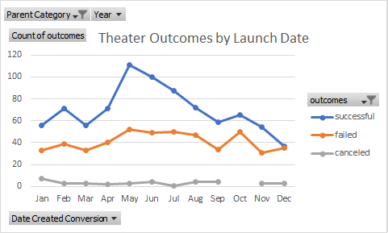
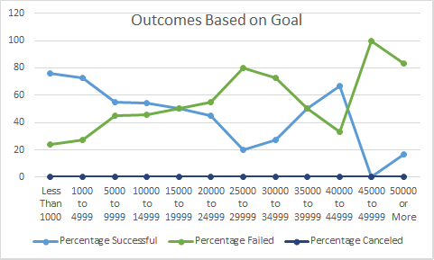

# Kickstarting with Excel

## Overview of Project
Louise managed a fund raising campaign for her play called Fever. However, it fell just short of its goal. She has compiled data from fundraisers around the world to be analysed.
### Purpose
 To improve the chances of managing a successful campaign in the future, she wants to analyse how other compaigns performed based on their launch dates and funding goals.
## Analysis and Challenges
### Analysis of Outcomes Based on Launch Date

The **Theater Outcomes by Launch Dates** graph gives perspective on which months yield the most and least successful fundraisers. Based on the data, it appears that the number of campaings launched each month does not differ greatly. However, the trend in our figue shows that the most successful campaigns are launched are the beginning of summer. On the other hand, campaigns launched in the winter have a much higher chance of failure.

### Analysis of Outcomes Based on Goals

The **Outcomes Based on Goals** graph analyses data for campaigns starting with goals less than $1,000 and moving up to goals greater than $50,000. The countifs formula was applied to determing the number of successful, failed and canceled fundraisers for each goal range. The table data showed that most campaigns had a goal $1,000 to $4,999.

### Challenges and Difficulties Encountered
Difficulties were encountered in getting the countifs formula correct for the outcomes based on goal analysis. The challenge came in figuring out where to place the limits for each goal in the formula. This was solved through research and a little trial and error.
## Results

### What are two conclusions you can draw about the Outcomes based on Launch Date?
The results of the research indicate that the best month to launch a campaign would be May as it has the most successful outcomes. Conversely, December is the month with th least successful month to launch funraisers. 

### What can you conclude about the Outcomes based on Goals?
Goals within the $0 to $1,000 range have the greatest success rate of 76%. 

### What are some limitations of this dataset?
The data does not provide a fair sample. For example, it would appear that the goal range of $0 to $1000 has the greatest chance of succes but the data is skewed towards the smaller donation amounts. The total funraisers below $5,000 is 720. This is far greater than the sum of fundraisers in all other goal ranges combined.

### What are some other possible tables and/or graphs that we could create?
A box plot vould illustrate that the data is may be skewed towards campaigns with goals less than $5,000.# Kickstarter-analysis
Kickstarter analysis of Launch Dates vs Funding Goals
